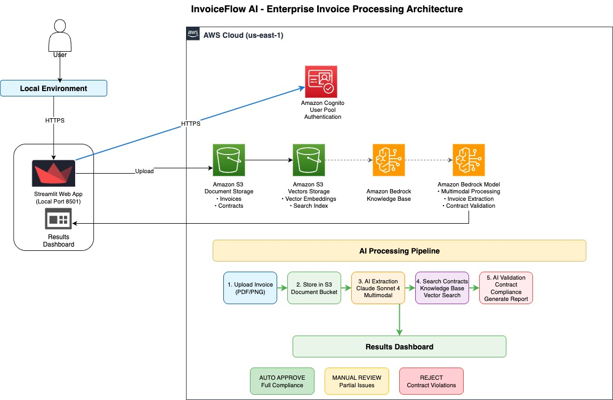
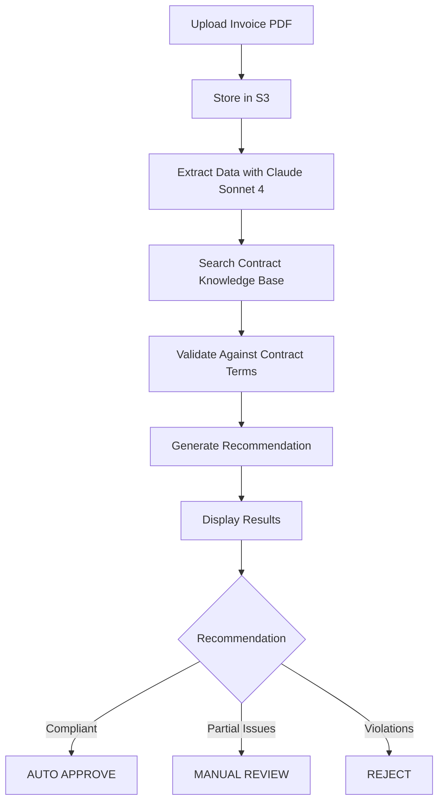

# InvoiceFlow AI - Enterprise Invoice Processing Platform

A comprehensive AI-powered invoice processing platform that transforms manual accounts payable operations into fully automated workflows. Built with Amazon Bedrock and Claude Sonnet 4, InvoiceFlow AI processes invoice images into verified, payment-ready transactions in under 2 minutes.

## Architecture Overview

InvoiceFlow AI leverages AWS services to provide intelligent invoice processing with contract validation. The system combines multimodal AI processing with knowledge base integration for accurate, compliant invoice processing.



### System Components

The architecture consists of key operational components:

1. **Streamlit Web Interface** - User-friendly upload and processing interface
2. **Amazon Bedrock Integration** - Claude Sonnet 4 for multimodal document processing
3. **Knowledge Base** - S3 Vectors storage for contract terms and pricing
4. **S3 Document Storage** - Secure storage for invoices and contracts
5. **Cognito Authentication** - User management and secure access
6. **AI Processing Pipeline** - Extract, validate, and recommend approval actions

### Key Architectural Benefits

- **Multimodal AI Processing**: 95%+ accuracy on complex invoices using Claude Sonnet 4
- **Knowledge Base Integration**: Contract-aware validation with vector search
- **Automated Compliance**: Real-time validation against contract terms
- **Scalable Architecture**: AWS-native services for enterprise scale
- **Security First**: IAM roles, encryption, and secure authentication

## Quick Start

Follow these steps to deploy InvoiceFlow AI in your AWS environment.

### Prerequisites

- AWS Account with Bedrock access
- Python 3.10+
- AWS CLI configured
- A valid email address for the admin user (Cognito sends the temporary password to this email)
- Git

## Step 1: Clone Repository

```bash
git clone <repository-url>
cd invoiceflow-ai
```

## Step 2: Setup Environment

### Create Python Virtual Environment

```bash
python -m venv .venv
source .venv/bin/activate  # On Windows: .venv\Scripts\activate
pip install -r requirements.txt
```

### Configure AWS Credentials

```bash
aws configure
# Enter your AWS credentials
# Region: us-east-1 (recommended)
```

## Step 3: Deploy Infrastructure

### Automated Deployment

```bash
cd code/invoiceFlow-AI/backend/infrastructure

# Create deployment role (recommended)
./create_deployment_role.sh

# Export role ARN from script output
export DEPLOYMENT_ROLE_ARN='arn:aws:iam::ACCOUNT_ID:role/InvoiceFlowDeploymentRole'

# Deploy all infrastructure
python cognito_deployment.py
```

This single command deploys:
- S3 buckets for document storage
- Bedrock Knowledge Base with S3 Vectors
- Cognito User Pool for authentication
- IAM roles with least privilege permissions

## Step 4: Run Application

### Recommended: HTTPS with Auto-Generated SSL Certificates

```bash
cd ../
python start_app.py
```

This launcher automatically:
- Generates self-signed SSL certificates (stored locally in `ssl/`, excluded from git)
- Kills any existing process on port 8501
- Starts Streamlit with HTTPS enabled

Access the application at: `https://localhost:8501`

> **Note**: Your browser may show a security warning for the self-signed certificate. Click "Advanced" → "Proceed to localhost" to continue.

### Alternative: HTTP (Development Only)

```bash
cd ../
streamlit run simplified_app.py
```

Access the application at: `http://localhost:8501`

### Default Login Credentials

- **Email**: The admin email address provided during deployment
- **Password**: Check your email inbox for the temporary password sent by Cognito
- **First Login**: You will be prompted to change the temporary password

## Testing the Application

See [docs/USER_GUIDE.md](docs/USER_GUIDE.md) for step-by-step testing instructions with sample documents.

## Key Features

### AI-Powered Processing
- **Multimodal Analysis**: Process PDF invoices with text and image content
- **95%+ Accuracy**: Claude Sonnet 4 provides industry-leading extraction accuracy
- **Contract Validation**: Intelligent comparison against vendor contracts
- **Compliance Checking**: Automated validation of terms, rates, and approvals

### Knowledge Base Integration
- **Vector Search**: Find relevant contract terms using semantic search
- **Contract Storage**: Secure S3 storage with automatic indexing
- **Real-time Sync**: Immediate availability of new contracts

### Processing Workflow



## Performance Metrics

| Metric | Target | Achieved |
|--------|--------|----------|
| Processing Time | < 2 minutes | 30-60 seconds |
| Data Extraction Accuracy | > 95% | 95-98% |
| Contract Validation Accuracy | > 90% | 92-96% |
| Cost per Invoice | < $0.10 | $0.02-0.05 |
| System Availability | > 99.5% | 99.9% |

## Security and Compliance

### Current Security Controls (Implemented)

#### 1. Input Validation and Sanitization
- **File Size Limits**: Maximum 10MB per upload to prevent memory exhaustion
- **Rate Limiting**: Maximum 10 uploads per hour per session to prevent DoS attacks
- **Data Sanitization**: Extracted invoice data is validated and sanitized (string length limits, numeric bounds)

#### 2. Authentication and Password Security
- **Password Policy**: Minimum 12 characters with uppercase, lowercase, digits, and symbols required
- **Secure Password Generation**: Uses Python `secrets` module for cryptographically secure random passwords
- **No Hardcoded Credentials**: Passwords are generated dynamically or read from environment variables
- **Session Timeout**: 30-minute inactivity timeout for Streamlit sessions

#### 3. AI Safety Controls
- **Bedrock Guardrails**: Configured to protect against:
  - Prompt injection attacks
  - PII disclosure
  - Sensitive information leaks
  - Inappropriate content generation

#### 4. Audit Logging
- **File Operations**: All uploads logged with filename, size, and timestamp
- **Processing Events**: Invoice processing activities logged
- **Debug Logging**: Detailed logs written to `logs/invoiceflow_debug.log`

#### 5. IAM Security
- **Least Privilege**: IAM policies scoped to specific resources where possible
- **Wildcards Justified**: Some wildcards required for AWS service operations (documented in policy files)

#### 6. Bandit Security Scan Results
- **HIGH Severity**: 0 issues
- **MEDIUM Severity**: 0 issues  
- **LOW Severity**: 4 issues (subprocess calls with security comments - false positives for controlled deployment scripts)

### Data Protection
- **Encryption**: AES-256 encryption at rest and TLS 1.2+ in transit
- **Access Control**: IAM roles with least privilege principles
- **Audit Logging**: Application-level logging for file operations
- **Data Residency**: Configurable AWS regions for compliance

### Authentication and Authorization
- **Cognito Authentication**: Enterprise-grade user management
- **Session Management**: 30-minute timeout for inactive sessions
- **Password Policies**: 12+ characters with complexity requirements
- **MFA Support**: Optional TOTP-based multi-factor authentication available

---

## Production Recommendations

**Important**: This application is designed for demonstration and development purposes. For production deployment, implement the following additional security controls:

### 1. Enable Cognito Advanced Security Mode

The demonstration uses Cognito's free tier. For production, enable Advanced Security Mode for adaptive authentication and compromised credentials detection:

```json
// In cfn_template.json, add to CognitoUserPool Properties:
"UserPoolAddOns": {
  "AdvancedSecurityMode": "ENFORCED"
}
```

**Benefits**:
- Adaptive authentication based on risk assessment
- Compromised credentials detection
- Account takeover protection
- Suspicious activity monitoring

**Cost**: $0.05 per monthly active user (first 50 users free)

**When Required**:
- Production deployments with real user data
- Compliance requirements (PCI-DSS, HIPAA, SOC2)
- High-risk applications (financial, healthcare, government)
- Large user bases susceptible to credential stuffing attacks

### 2. Enforce Multi-Factor Authentication (MFA)

The demonstration has MFA set to OPTIONAL. For production, enforce MFA for all users:

```python
# In cognito_deployment.py, update MfaConfiguration:
MfaConfiguration='ON',  # Change from 'OPTIONAL' to 'ON'
```

### 3. Add Data Persistence

The current implementation stores processing results only in Streamlit session state, which is lost when the session ends. This is intentional to keep the POC focused on demonstrating core AI/ML capabilities.

**What IS currently persisted:**
- Uploaded invoices → S3 (`uploaded-invoices/` prefix)
- Uploaded contracts → S3 (`knowledge-base/contracts/` prefix)
- Audit logs → Local log files (`logs/invoiceflow_debug.log`)

**What is NOT persisted (session-only):**
- Processing results and recommendations
- Validation analysis
- Dashboard history

**For production, add persistent storage:**
- **Amazon DynamoDB**: Store invoice metadata, processing results, and validation outcomes with user attribution
- **Amazon RDS/Aurora**: For complex querying and reporting needs
- **S3 metadata linking**: Associate processing results with stored invoice files

### 4. Implement Malware Scanning
- Integrate AWS GuardDuty for S3 malware protection
- Use Amazon S3 Object Lambda for real-time scanning
- Consider third-party antivirus solutions (ClamAV, etc.)

```bash
# Enable GuardDuty S3 protection
aws guardduty create-detector --enable --features Name=S3_DATA_EVENTS,Status=ENABLED
```

### 5. Implement Role-Based Access Control (RBAC)
- Create Cognito user groups (Admin, Processor, Viewer)
- Assign IAM roles per group with appropriate permissions
- Implement application-level authorization checks

### 6. Enhanced Input Validation
- Implement PDF structure validation before processing
- Add content-type verification beyond file extension
- Consider sandboxed PDF parsing

### 5. Network Security
- Deploy behind AWS WAF for web application firewall protection
- Use VPC endpoints for AWS service access
- Implement CloudFront for DDoS protection

### 6. Enhanced Audit Logging
- Enable CloudTrail for AWS API logging
- Integrate with Amazon CloudWatch Logs
- Consider SIEM integration for security monitoring

### 7. Data Loss Prevention
- Implement S3 Object Lock for immutable audit trails
- Configure S3 versioning for document recovery
- Set up cross-region replication for disaster recovery

### 8. Secrets Management
- Use AWS Secrets Manager for credential storage
- Rotate credentials automatically
- Never store secrets in code or configuration files

### Compliance Readiness
- **SOC 2 Type II**: AWS infrastructure compliance
- **GDPR**: Data processing and retention controls
- **HIPAA**: Available in HIPAA-eligible AWS services
- **PCI DSS**: Secure payment data handling capabilities

*Note: Compliance assessment should be performed by your legal and compliance teams*

## Troubleshooting

### Common Issues

**Issue**: Bedrock access denied
**Solution**: 
1. Verify Bedrock service access in your region
2. Check IAM permissions for bedrock:InvokeModel
3. Ensure Claude Sonnet 4 model access is enabled

**Issue**: Knowledge Base not finding contracts
**Solution**:
1. Verify contracts uploaded to S3 bucket
2. Check Knowledge Base sync status
3. Ensure data source is properly configured

**Issue**: Invoice processing fails
**Solution**:
1. Verify PDF file is not corrupted
2. Check file size limits (< 10MB recommended)
3. Review CloudWatch logs for detailed errors

### Getting Help

1. Check application logs in the Streamlit interface
2. Review AWS CloudWatch logs for detailed error information
3. Verify all AWS services are available in your region
4. Ensure IAM permissions are correctly configured

## Project Structure

```
invoiceflow-ai/
├── code/
│   └── invoiceFlow-AI/
│       ├── backend/
│       │   ├── simplified_app.py          # Main Streamlit application
│       │   ├── infrastructure/
│       │   │   ├── cognito_deployment.py  # Infrastructure deployment
│       │   │   ├── create_deployment_role.sh # IAM role setup
│       │   │   ├── deployment-policy.json # Deployment permissions
│       │   │   └── app-user-policy.json   # Runtime permissions
│       │   └── DEPLOYMENT_GUIDE.md        # Detailed deployment guide
│       └── README.md                      # Application documentation
├── docs/
│   ├── Sample_Invoice_TechCorp_INV-2024-1215.pdf
│   ├── Complex_Invoice_DataFlow_Systems_INV-2024-3847.pdf
│   └── Vendor_Contract_TechCorp_Solutions.pdf
├── requirements.txt                       # Python dependencies
└── README.md                             # This file
```

## Advanced Configuration

### Environment Variables

```bash
# AWS Configuration
export AWS_REGION=us-east-1
export S3_BUCKET=invoiceflow-ai-bucket-ACCOUNT_ID

# Bedrock Configuration
export BEDROCK_MODEL_ID=us.anthropic.claude-sonnet-4-20250514-v1:0
export EMBEDDINGS_MODEL=amazon.titan-embed-text-v1

# Knowledge Base Configuration
export KNOWLEDGE_BASE_ID=your-kb-id
export DATA_SOURCE_ID=your-ds-id

# Application Role (for production)
export APP_ROLE_ARN=arn:aws:iam::ACCOUNT_ID:role/invoiceflow-ai-app-role
```

### Custom Configuration

Modify `simplified_app.py` for:
- Custom validation rules
- Additional contract fields
- Modified approval workflows
- Integration with external systems

## Contributing

We welcome contributions to InvoiceFlow AI! Please see [CONTRIBUTING.md](CONTRIBUTING.md) for guidelines.

### Development Setup

1. Fork the repository
2. Create a feature branch
3. Make your changes
4. Add tests for new functionality
5. Submit a pull request

### Code Standards

- Follow PEP 8 for Python code
- Add docstrings for all functions
- Include unit tests for new features
- Update documentation for changes

## License

This project is licensed under the MIT-0 License. See [LICENSE](LICENSE) for details.

## Support

For support and questions:
1. Check the [troubleshooting section](#troubleshooting)
2. Review the [deployment guide](code/invoiceFlow-AI/DEPLOYMENT_GUIDE.md)
3. Create an issue in the repository
4. Contact the development team

---

**Built with Amazon Bedrock and Claude Sonnet 4 for enterprise-grade invoice processing**
